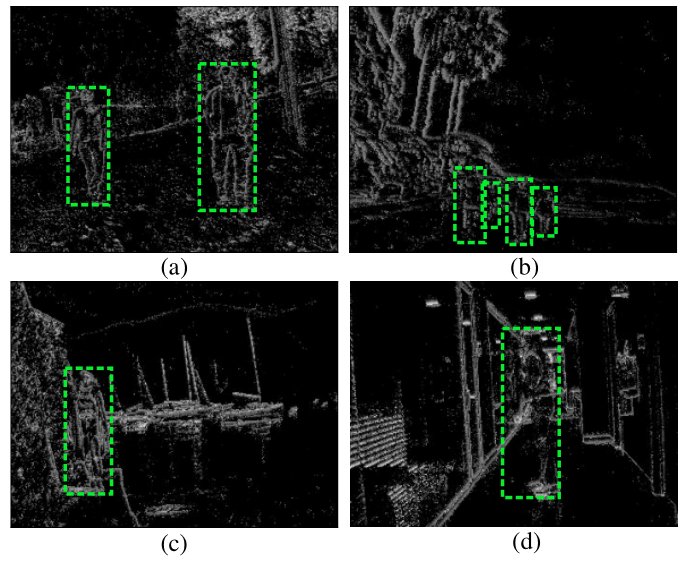

# PEDRo: an Event-based Dataset for Person Detection in Robotics

The PEDRo events dataset is specifically designed for person detection in service robotics. The dataset has been collected by using a moving [DAVIS346](https://inivation.com/wp-content/uploads/2019/08/DAVIS346.pdf) event camera in a wide variety of scenarios and lighting conditions. 


The dataset is composed of:

- 119 recordigs with an average duration of 18 seconds.
- 43 259 bounding boxes manually annotated.
- 27 000 samples of 40 milliseconds each.

This dataset focuses on people, making it a relevant addition to other existing event-based datasets that tackle the person detection task.
The PEDRo dataset can be downloaded [here](https://zenodo.org/record/7823800#.ZDiAO3ZBy5c).

## Citations

If you use PEDRo dataset, please cite [our paper](). The code is available under the [BSD-2-Clause License](./LICENSE).

```bibtex
@inproceedings{bbpprsPedro2023,
      title={PEDRo: an Event-based Dataset for Person Detection in Robotics},
      author={Boretti, Chiara and Bich, Philippe and Pareschi, Fabio and Prono, Luciano and Rovatti, Riccardo and Setti, Gianluca},
      booktitle={IEEE/CVF Conference on Computer Vision and Pattern Recognition Workshops (CVPRW)},
      month=jun,
      year={2023}
}
```

## Details on the dataset

The dataset contains # independent people from 20 to 70 years old, recorded in a wide variety of scenarios and  metereological conditions (sunny, snowy and rainy), during day and night. The scenarios are both outdoor and indoor, ranging from mountains, lakes and seafronts to offices and houses.
The main part of the people in the dataset are walking, but there are also example of people standing and sitting.

<p align="center">
      
      
</p>

### Dataset collection and labeling
The dataset has been recorded by using a DAVIS346 event camera which outputs simultaneously events and grayscale frames. The camera has been hand-carried to capture the events and the height of the sensor varies among recordings.
The dataset has been manually labeled by the authors using the grayscale images.

<p align="center">
      
</p>

The dataset is composed of 119 recordings and it has been split in train, validation and test sets. Every recording belongs entirely to one of these three groups. 
The 43 259 bounding boxes have been divided in 34 243 (79.2%) in train, 4372 (10.1%) in validation and 4179 (9.7%) in test. 
In particular, all the bounding boxes are contained in 27 000 samples. Each sample is the stream of events collected in a time interval of 40 ms, time determined by the acquisition rate of the grayscale images used for the manual labeling process.

### Dataset format
The dataset is provided as follows:
- a **numpy** folder where are contained all the samples. Each sample is a numpy structure where the events are stored, an event is composed of 4 fields:

  | Field | Description |
  | ------------- | ------------- |
  | t  | timestamp at which the event occurs  |
  | x  | x-coordinate of the pixel at which the event occurs  |
  | y  | y-coordinate of the pixel at which the event occurs  |
  | p  | polarity of the event (1 for positive or 0 for negative)  |

- an **xml** folder where are contained the labels in PASCAL-VOC format.
- a **yolo** folder where are contained the labels in YOLO format.
- a text file where are listed all the recordings and in which way are they split in train, validation and test sets.
Each folder is divided in train, test, validation and test and the samples are coupled with their corresponding labels by considering the matching names.
  > *frame0000001.npy* is associated with *frame0000001.xml* and *frame0000001.txt*
  
## Utils
The jupyter notebook *Visualize_dataset.ipynb* can be used to see some examples of the recordings, organized as Surface of Active Events (SAE), with the corresponding labels. Some test samples are in the **example** folder.
